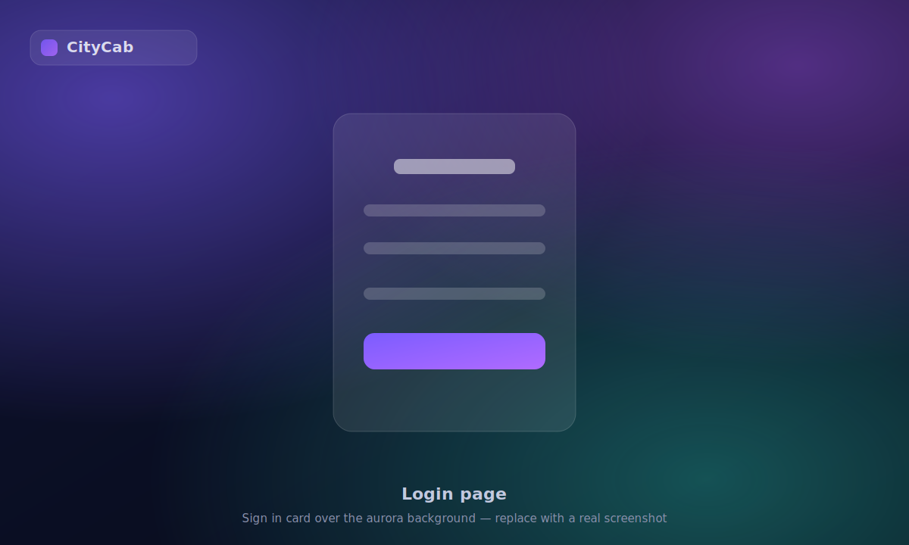
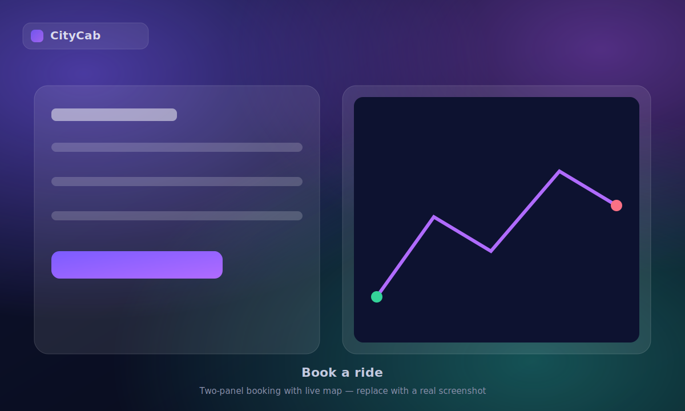
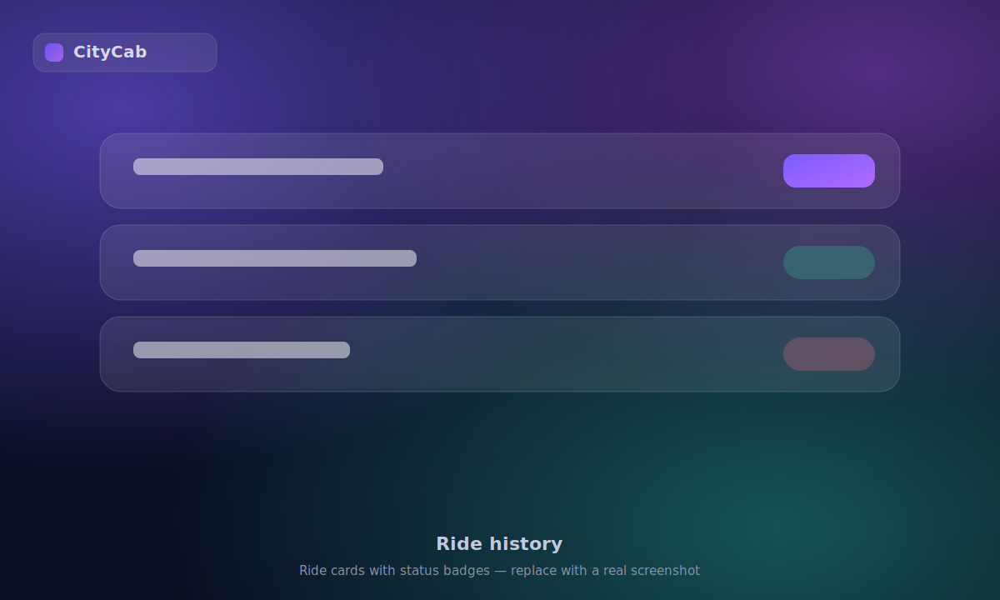
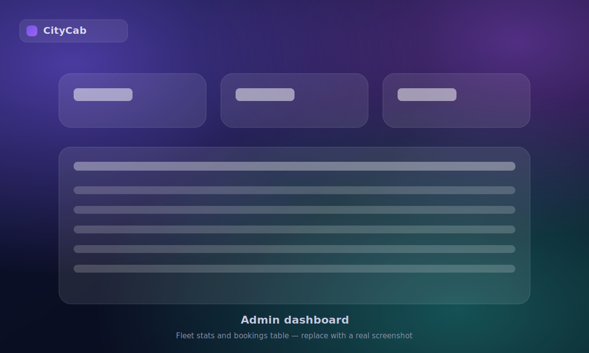

<div align="center">

# 🚖 CityCab

**A premium, full-stack cab-booking web application built with Flask.**

Book instant or scheduled rides on an interactive map, track your ride history, and manage the fleet through dedicated driver and admin dashboards — wrapped in a modern glassmorphism UI.

[](https://www.python.org/)
[](https://flask.palletsprojects.com/)
[](https://leafletjs.com/)
[](LICENSE)

</div>

---

## 📖 Overview

CityCab is a ride-booking application where passengers can request instant rides or schedule them for later, with live route drawing and fare estimation on an interactive map. Drivers accept ride requests from their own dashboard, and administrators oversee every booking from an operations view. It is a self-contained Flask monolith intended as a learning and portfolio project that demonstrates authentication, an ORM data layer, role-based access, and a hand-built responsive front end.

> **Note:** CityCab is a demonstration project. It simulates the booking workflow end-to-end but does not process real payments or dispatch real vehicles.

---

## ✨ Features

- **Authentication** — register, log in, and log out with securely hashed passwords (Werkzeug PBKDF2).
- **Instant booking** — enter pickup and drop addresses; the app geocodes them, draws the driving route, and estimates the fare live.
- **Scheduled rides** — book a ride for a future date and time.
- **Ride history** — view past and upcoming rides with status badges and one-click cancellation.
- **Driver dashboard** — see available ride requests, accept them, and auto-refresh the queue.
- **Admin dashboard** — browse every booking in a searchable, sortable table with fleet statistics.
- **Profile management** — update your name and phone, upload an avatar, and change your password.
- **Role-based access** — separate capabilities for passengers, drivers, and admins.
- **Modern UI** — a reusable glassmorphism design system with an animated aurora background, toast notifications, and a fully responsive layout.

---

## 🖼️ Screenshots

> Placeholder previews are included in [`docs/screenshots/`](docs/screenshots). Replace them with real captures of your running app.

| Login | Book a ride |
| :---: | :---: |
|  |  |

| Ride history | Admin dashboard |
| :---: | :---: |
|  |  |

---

## 🛠️ Technology Stack

**Backend**

- [Python 3.10+](https://www.python.org/)
- [Flask](https://flask.palletsprojects.com/) — web framework
- [Flask-SQLAlchemy](https://flask-sqlalchemy.palletsprojects.com/) — ORM
- [Flask-Login](https://flask-login.readthedocs.io/) — session management
- [Flask-Migrate](https://flask-migrate.readthedocs.io/) / [Alembic](https://alembic.sqlalchemy.org/) — database migrations
- [Werkzeug](https://werkzeug.palletsprojects.com/) — password hashing & utilities
- [python-dotenv](https://pypi.org/project/python-dotenv/) — environment configuration
- SQLite — default database

**Frontend**

- Jinja2 templates with a shared `base.html` layout
- Custom CSS design system (`static/css/citycab.css`) — no framework
- Vanilla JavaScript UI runtime (`static/js/citycab.js`) — toasts, navbar, validation
- [Leaflet](https://leafletjs.com/) + [OpenStreetMap](https://www.openstreetmap.org/) — interactive maps (no API key)
- [OSRM](http://project-osrm.org/) — driving-route calculation
- [Nominatim](https://nominatim.org/) — address geocoding
- [DataTables](https://datatables.net/) — admin table

---

## 🏗️ Project Architecture

CityCab is a single-process Flask monolith. The request flow is:

```
Browser
  │  HTML form / fetch()
  ▼
Flask routes (app.py) ──► Flask-Login (auth & sessions)
  │                          │
  │                          ▼
  │                   role checks (user / driver / admin)
  ▼
SQLAlchemy ORM ──► SQLite (instance/citycab.db)
  ▲
  │  models: User, Booking
  ▼
Jinja2 templates (extend base.html) + static design system
  │
  ▼
Client JS ──► Leaflet map ──► Nominatim (geocode) + OSRM (route)
```

- **Models** — `User` (with `is_driver` / `is_admin` flags) and `Booking` (instant or future rides), related by foreign keys.
- **Routes** — passenger, driver, and profile routes live in `app.py`; admin routes are grouped in a Flask **Blueprint** (`/admin`).
- **Templates** — every page extends `templates/base.html`, which provides the aurora background, the reusable navbar partial, and the flash-to-toast bridge.
- **Design system** — one CSS file and one JS file are shared across all pages for consistency and maintainability.
- **Maps** — routing and geocoding happen client-side against free OpenStreetMap services, so no API key or billing is required.

---

## 🚀 Installation

### Prerequisites

- Python 3.10 or newer
- `pip` and `venv`

### Steps

```bash
# 1. Clone the repository
git clone https://github.com/Ramandeep-Singh-Mathaon/CityCab.git
cd CityCab

# 2. Create and activate a virtual environment
python -m venv venv
# Windows (PowerShell)
.\venv\Scripts\Activate.ps1
# macOS / Linux
source venv/bin/activate

# 3. Install dependencies
pip install -r requirements.txt
```

---

## ⚙️ Configuration

Copy the example environment file and adjust the values:

```bash
cp .env.example .env      # Windows: copy .env.example .env
```

| Variable       | Description                                        | Default                   |
| -------------- | -------------------------------------------------- | ------------------------- |
| `SECRET_KEY`   | Flask session-signing key (use a long random one)  | `dev`                     |
| `DATABASE_URL` | SQLAlchemy database URL                            | `sqlite:///citycab.db`    |
| `FLASK_DEBUG`  | Set to `1` to enable debug mode locally            | `0`                       |

Generate a strong secret key:

```bash
python -c "import secrets; print(secrets.token_hex(32))"
```

---

## ▶️ Usage

```bash
python app.py
```

Then open **http://127.0.0.1:5000** in your browser.

The database (`instance/citycab.db`) and its tables are created automatically on first run. To try each role:

1. **Register** a passenger account and book an instant or scheduled ride.
2. To test the **driver** or **admin** views, set the flags on a user (e.g. via a Python shell):

   ```python
   from app import app, db, User
   with app.app_context():
       u = User.query.filter_by(email="you@example.com").first()
       u.is_driver = True   # or u.is_admin = True
       db.session.commit()
   ```

3. Visit `/driver` (driver dashboard) or `/admin/` (admin dashboard).

---

## 📁 Folder Structure

```
CityCab/
├── app.py                      # Flask app: models, routes, admin blueprint, error handlers
├── requirements.txt            # Python dependencies
├── .env.example                # Environment variable template
├── .gitignore
├── LICENSE
├── README.md
├── migrations/                 # Alembic / Flask-Migrate database migrations
├── docs/
│   └── screenshots/            # README screenshot placeholders
├── static/
│   ├── css/
│   │   └── citycab.css         # Glassmorphism design system
│   ├── js/
│   │   └── citycab.js          # Toasts, navbar, form helpers
│   ├── confirmation.mp3        # Booking confirmation sound
│   └── uploads/                # User avatars (git-ignored)
└── templates/
    ├── base.html               # Shared layout (aurora bg, navbar, toast bridge)
    ├── partials/
    │   └── navbar.html         # Reusable top navigation
    ├── login.html
    ├── register.html
    ├── book.html               # Instant booking + map
    ├── future_book.html        # Scheduled booking + map
    ├── rides.html              # Ride history
    ├── profile.html            # Profile & password management
    ├── driver_dashboard.html   # Driver view
    ├── admin.html              # Admin operations dashboard
    └── error.html              # Friendly error page
```

---

## 🗺️ Future Roadmap

- [ ] Real-time driver location and ride tracking (WebSockets)
- [ ] Server-side fare calculation and validation
- [ ] Automated test suite (pytest) and CI via GitHub Actions
- [ ] Payment gateway integration (sandbox)
- [ ] Address autocomplete suggestions while typing
- [ ] Rider ratings and driver reviews
- [ ] Dockerfile and one-command deployment
- [ ] Migrate from ad-hoc column creation to fully migration-driven schema

---

## ⚠️ Known Limitations

- **Free map services** — geocoding (Nominatim) and routing (OSRM) use public demo endpoints that are rate-limited (~1 request/second) and are not intended for production traffic. Self-host or use a paid provider at scale.
- **Illustrative fares** — fares are simple distance-based estimates computed client-side, not authoritative pricing.
- **SQLite** — great for development, but single-writer; use PostgreSQL for concurrent production loads.
- **Account deletion** is a UI stub and does not remove data yet.
- **No automated tests** are included yet (see roadmap).
- The schema is bootstrapped with `db.create_all()` plus a few defensive `ALTER TABLE` statements for backward compatibility; new work should prefer Alembic migrations.

---

## 🙏 Credits

- [OpenStreetMap](https://www.openstreetmap.org/) contributors — map data
- [Leaflet](https://leafletjs.com/), [OSRM](http://project-osrm.org/), [Nominatim](https://nominatim.org/) — mapping stack
- [CARTO](https://carto.com/) — dark basemap tiles
- [Flask](https://flask.palletsprojects.com/) and its ecosystem
- Icons hand-drawn as inline SVG in the [Lucide](https://lucide.dev/) style

---

## 🤖 AI Assistance Disclosure

Parts of this project — the glassmorphism UI redesign, several bug fixes (including a database path and a Windows-specific SQLite URL issue), the migration from Google Maps to the free OpenStreetMap stack, and this documentation — were developed with the assistance of an AI coding assistant. All code was reviewed, tested, and integrated by the author, who remains responsible for the project.

---

## 📄 License

This project is licensed under the **MIT License** — see the [LICENSE](LICENSE) file for details.

---

<div align="center">
Built with Flask and a lot of CSS. Contributions welcome — see <a href="CONTRIBUTING.md">CONTRIBUTING.md</a>.
</div>
